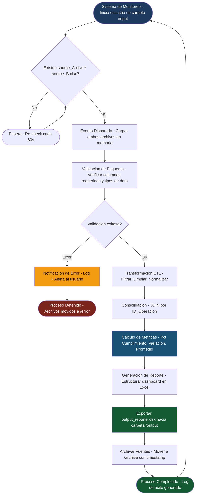
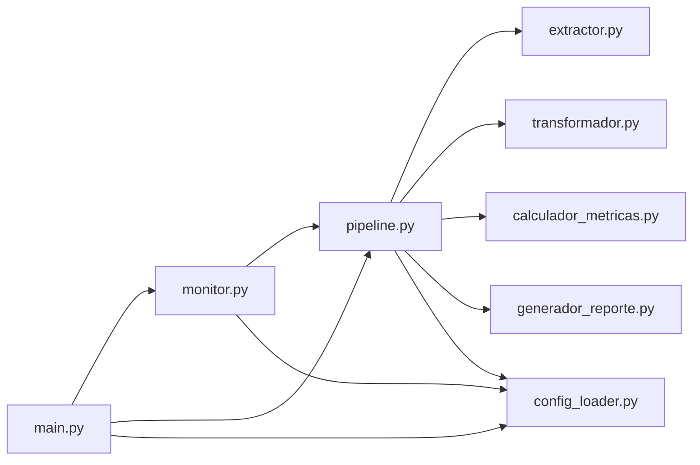
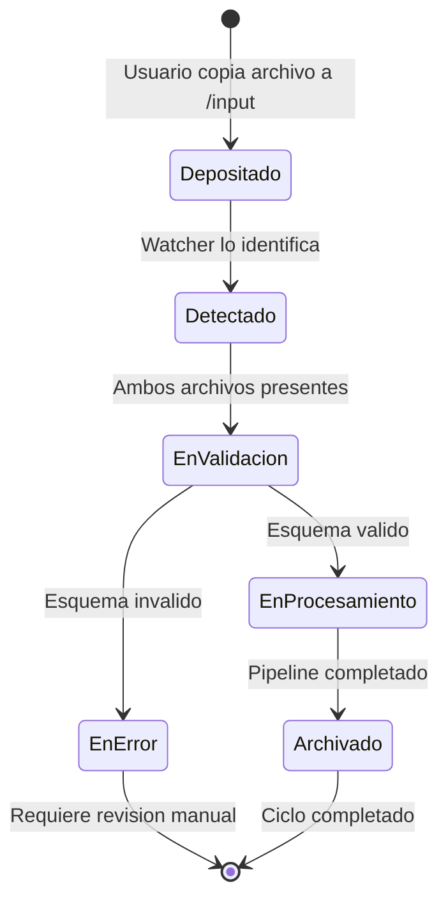

# Diagrama de Flujo — Pipeline ETL SistemaIndicadoresKPI

## Diagrama Principal (Mermaid.js)

```mermaid
flowchart TD
    A([Sistema de Monitoreo - Inicia escucha de carpeta /input]) --> B{Existen source_A.xlsx Y source_B.xlsx?}
    B -- No --> C([Espera - Re-check cada 60s])
    C --> B
    B -- Si --> D[Evento Disparado - Cargar ambos archivos en memoria]
    D --> E[Validacion de Esquema - Verificar columnas requeridas y tipos de dato]
    E --> F{Validacion exitosa?}
    F -- Error --> G[Notificacion de Error - Log + Alerta al usuario]
    G --> H([Proceso Detenido - Archivos movidos a /error])
    F -- OK --> I[Transformacion ETL - Filtrar, Limpiar, Normalizar]
    I --> J[Consolidacion - JOIN por ID_Operacion]
    J --> K[Calculo de Metricas - Pct Cumplimiento, Variacion, Promedio]
    K --> L[Generacion de Reporte - Estructurar dashboard en Excel]
    L --> M[Exportar output_reporte.xlsx hacia carpeta /output]
    M --> N[Archivar Fuentes - Mover a /archive con timestamp]
    N --> O([Proceso Completado - Log de exito generado])
    O --> A
    style A fill:#1e3a5f,color:#fff
    style O fill:#145a32,color:#fff
    style H fill:#7b241c,color:#fff
    style G fill:#f39c12,color:#000
    style K fill:#1a5276,color:#fff
    style M fill:#145a32,color:#fff
```

## Diagrama de Modulos

```mermaid
graph LR
    main[main.py] --> monitor[monitor.py]
    main --> pipeline[pipeline.py]
    monitor --> pipeline
    pipeline --> extractor[extractor.py]
    pipeline --> transformador[transformador.py]
    pipeline --> calculador[calculador_metricas.py]
    pipeline --> generador[generador_reporte.py]
    main --> config_loader[config_loader.py]
    monitor --> config_loader
    pipeline --> config_loader
```

## Diagrama de Estados del Archivo

```mermaid
stateDiagram-v2
    [*] --> Depositado : Usuario copia archivo a /input
    Depositado --> Detectado : Watcher lo identifica
    Detectado --> EnValidacion : Ambos archivos presentes
    EnValidacion --> EnProcesamiento : Esquema valido
    EnValidacion --> EnError : Esquema invalido
    EnProcesamiento --> Archivado : Pipeline completado
    EnError --> [*] : Requiere revision manual
    Archivado --> [*] : Ciclo completado
```
